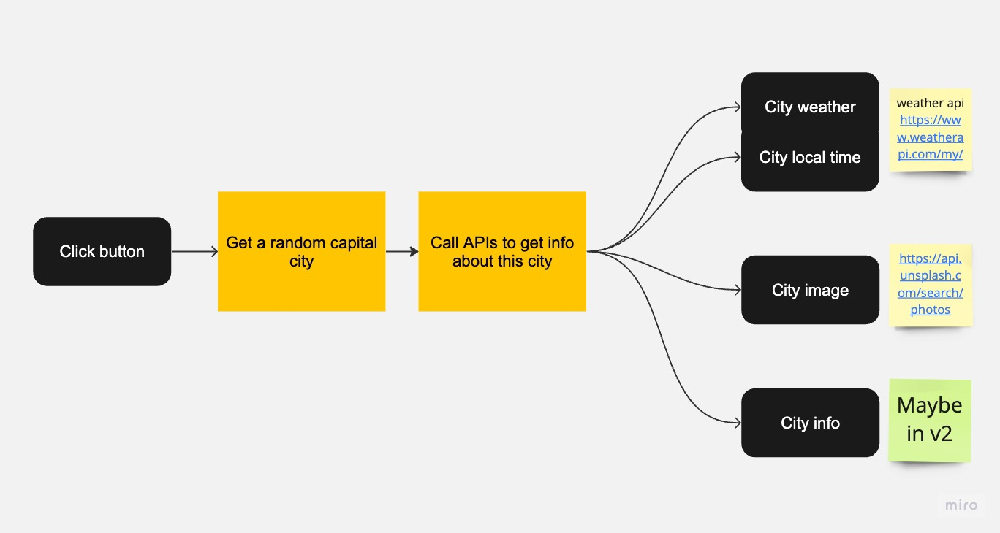

### Intro

An app to show you the current weather and its local time of a random capital city.

https://random-city-info-rg.vercel.app/

### Notes

(just to practise what I've learnt so far..)

- Use React (incl. `useState`, `useEffect`)
- Use REST Countries API, Weather API, and Unslash API
- And some helpers: `Tailwind`, `React Query`, `react-spinners`
- Use `environment variables` to store secret keys.
- Diagram
  
